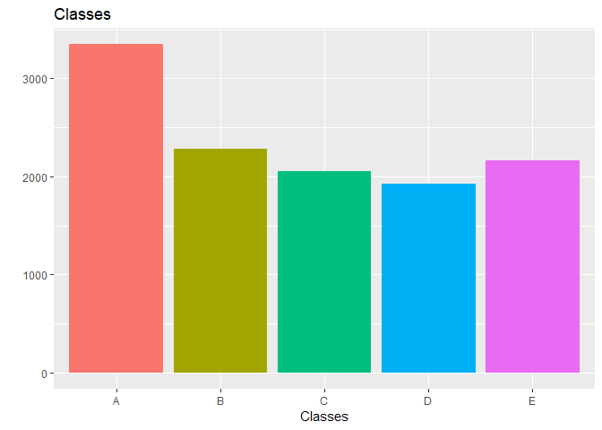
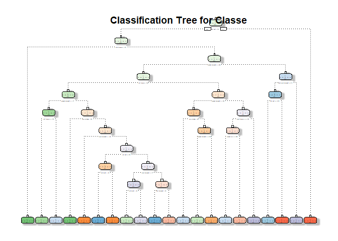

#Background

Using devices such as Jawbone Up, Nike FuelBand, and Fitbit it is now possible to collect a large amount of data about personal activity relatively inexpensively. These type of devices are part of the quantified self movement - a group of enthusiasts who take measurements about themselves regularly to improve their health, to find patterns in their behavior, or because they are tech geeks. One thing that people regularly do is quantify how much of a particular activity they do, but they rarely quantify how well they do it. In this project, your goal will be to use data from accelerometers on the belt, forearm, arm, and dumbell of 6 participants. They were asked to perform barbell lifts correctly and incorrectly in 5 different ways. More information is available from the website here: http://groupware.les.inf.puc-rio.br/har (see the section on the Weight Lifting Exercise Dataset)

The goal of this report is to predict the manner in which they did the exercise. This is the "classe" variable in the training set

#Preprocessing

The first step is to download and read the data.


```r
if(!file.exists("training.csv")){ download.file("https://d396qusza40orc.cloudfront.net/predmachlearn/pml-training.csv", "training.csv", mode = "wb")
}
if(!file.exists("testing.csv")){ download.file("https://d396qusza40orc.cloudfront.net/predmachlearn/pml-testing.csv", "testing.csv", mode = "wb")
}
training <- read.csv("training.csv")
testing <- read.csv("testing.csv")
```

After, we remove the columns with NA values from the training data set.


```r
na <- colSums(is.na(training))
training <- training[,na == 0]
```

Then we remove the variables with near zero variance.


```r
library(caret)
```

```
## Loading required package: lattice
```

```
## Loading required package: ggplot2
```

```r
nzv <- nearZeroVar(training)
training <- training[,-nzv]
```

Later, we remove the identification variables because they aren't usable as predictors (first five columns).


```r
training <- training[,-(1:5)]
```

And finally, we proceed to sub-sample the training set into a smaller training set and new test set.


```r
set.seed(1995)
inTrain <- createDataPartition(y = training$classe, p = 0.6, list = FALSE)
train_set <- training[inTrain, ]
test_set <- training[-inTrain,]
dim(train_set)
```

```
## [1] 11776    54
```

```r
dim(test_set)
```

```
## [1] 7846   54
```

```r
library(ggplot2)
qplot(train_set$classe, main = "Classes", xlab = "Classes", fill = train_set$classe)+theme(legend.position = "none")
```

<!-- -->

#Model Building

We'll build two models a classification tree and a random forest, the final model will be the one with the highest accuracy.

## Classification Tree

```r
library(rpart)
ctm <- rpart(classe~., data = train_set, method = "class")
ctmp <- predict(ctm, newdata = test_set, type = "class")
confusionMatrix(ctmp, test_set$classe)
```

```
## Confusion Matrix and Statistics
## 
##           Reference
## Prediction    A    B    C    D    E
##          A 2008  308   66   84  108
##          B   62  907  102  118  185
##          C   14   87 1026  190   85
##          D  117  149  134  766   70
##          E   31   67   40  128  994
## 
## Overall Statistics
##                                           
##                Accuracy : 0.7266          
##                  95% CI : (0.7166, 0.7365)
##     No Information Rate : 0.2845          
##     P-Value [Acc > NIR] : < 2.2e-16       
##                                           
##                   Kappa : 0.6523          
##  Mcnemar's Test P-Value : < 2.2e-16       
## 
## Statistics by Class:
## 
##                      Class: A Class: B Class: C Class: D Class: E
## Sensitivity            0.8996   0.5975   0.7500  0.59565   0.6893
## Specificity            0.8992   0.9262   0.9420  0.92835   0.9585
## Pos Pred Value         0.7801   0.6601   0.7318  0.61974   0.7889
## Neg Pred Value         0.9575   0.9056   0.9469  0.92133   0.9320
## Prevalence             0.2845   0.1935   0.1744  0.16391   0.1838
## Detection Rate         0.2559   0.1156   0.1308  0.09763   0.1267
## Detection Prevalence   0.3281   0.1751   0.1787  0.15753   0.1606
## Balanced Accuracy      0.8994   0.7618   0.8460  0.76200   0.8239
```

```r
library(rattle)
```

```
## Rattle: A free graphical interface for data science with R.
## Version 5.2.0 Copyright (c) 2006-2018 Togaware Pty Ltd.
## Type 'rattle()' to shake, rattle, and roll your data.
```

```r
fancyRpartPlot(ctm, main = "Classification Tree for Classe", sub = "")
```

<!-- -->

##Random Forest

```r
rfm <- train(classe~., data = train_set, method = "rf", trControl = trainControl(method = "cv", number = 3, verboseIter = FALSE))
rfmp <- predict(rfm, newdata = test_set)
confusionMatrix(rfmp, test_set$classe)
```

```
## Confusion Matrix and Statistics
## 
##           Reference
## Prediction    A    B    C    D    E
##          A 2231    3    0    0    0
##          B    0 1511    5    0    0
##          C    0    3 1362    9    0
##          D    0    1    1 1277    9
##          E    1    0    0    0 1433
## 
## Overall Statistics
##                                           
##                Accuracy : 0.9959          
##                  95% CI : (0.9942, 0.9972)
##     No Information Rate : 0.2845          
##     P-Value [Acc > NIR] : < 2.2e-16       
##                                           
##                   Kappa : 0.9948          
##  Mcnemar's Test P-Value : NA              
## 
## Statistics by Class:
## 
##                      Class: A Class: B Class: C Class: D Class: E
## Sensitivity            0.9996   0.9954   0.9956   0.9930   0.9938
## Specificity            0.9995   0.9992   0.9981   0.9983   0.9998
## Pos Pred Value         0.9987   0.9967   0.9913   0.9915   0.9993
## Neg Pred Value         0.9998   0.9989   0.9991   0.9986   0.9986
## Prevalence             0.2845   0.1935   0.1744   0.1639   0.1838
## Detection Rate         0.2843   0.1926   0.1736   0.1628   0.1826
## Detection Prevalence   0.2847   0.1932   0.1751   0.1642   0.1828
## Balanced Accuracy      0.9995   0.9973   0.9969   0.9957   0.9968
```

#Model Selection
Our definitive model is the Random Forest Model (0.9962) which has the highest accuracy, in comparison with the classification tree model (0.7266)

##Final Model Prediction

```r
rfmv <- predict(rfm, newdata = testing)
rfmv
```

```
##  [1] B A B A A E D B A A B C B A E E A B B B
## Levels: A B C D E
```

